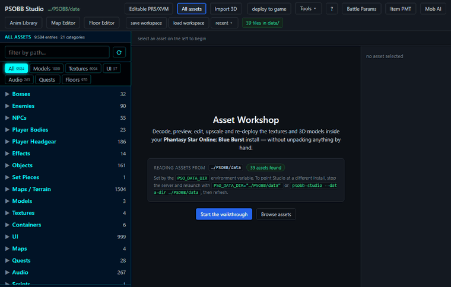

# psobb-studio

[](https://github.com/therealpixelated/psobb-studio/actions/workflows/smoke.yml)
[](https://www.python.org/downloads/)
[](#quickstart)

**A browser-based asset studio for *Phantasy Star Online: Blue Burst*.** Browse and convert textures, import/export and decimate models, build and copy floors, and manage audio — all from a single web UI, against the real files in your own PSOBB install. A FastAPI backend decodes the game's proprietary formats and serves them to a Three.js frontend; nothing is unpacked by hand and the live install is never written until you say so.



*Five beats from the studio: the classified asset browser, a decoded boss model in the 3D viewer, a texture's tiles, the Floor editor, and the audio suite (codec badge + waveform). The GIF is produced by [`scripts/demo_capture.py`](scripts/demo_capture.py) — see [Visual demo](#visual-demo).*

---

## What it is

psobb-studio reads the asset files from a local PSOBB install, decodes the game's model / texture / archive / audio formats, and lets you **view, edit, upscale, convert, and re-pack** them from the browser — then stage the rebuilt files into a dev mirror for testing. It pairs:

- a **FastAPI** backend (`server.py`, ~150 localhost-only routes) plus a `formats/` package of pure-Python binary readers/writers, with
- a vanilla-JavaScript, **Three.js** frontend in `static/` (one module per panel).

It is a hobbyist modding tool: **you supply your own game files**, and no game assets are bundled or distributed with it. Everything you edit lands in a dev directory that shadows the live install; the playable game is only touched when you explicitly promote a file.

---

## Feature highlights

### Textures
- **Decode** XVR / PVR tiles out of XVM texture archives and PRS-compressed UI atlases into editable PNGs (`formats/xvr_decode.py`, `formats/pvr_decode.py`, `formats/prs.py`).
- **Encode** edited tiles back to PVR/XVR — the direct-colour formats round-trip byte-exact (see the [codec table](#codec-coverage) for exactly which formats, and what is deliberately *not* supported).
- **Upscale** a single tile, a whole atlas composite (full spatial context across tile seams), or an externally-upscaled PNG you drop in. Backed by Real-ESRGAN (ncnn-vulkan) when the binary is present; `keep native dim` Lanczos-downsamples back so the rebuilt PRS still loads in the engine.

### Models
- **3D viewer** for chunk-Ninja `.nj` and descriptor-table `.xj` models, including inners pulled from BML and AFS containers, with skinned meshes, bone skeletons, NJM motion playback, and a PSOBB-matched Lambert shader.
- **Import** external `.obj` / `.gltf` / `.glb` / `.fbx` (Blender / Maya / Unity), convert to a deployable `.nj`, and splice it into a target BML inner.
- **Decimate** (quadric-error mesh reduction) and **strippify** (triangle-strip generation) to fit engine budgets.
- **Author** models back out: NJ, XJ, and NJM all have byte-exact encoders (`nj_writer.py`, `xj_writer.py`, `njm_writer.py`) that round-trip the shipped game files.

### Floors
- A full **GLB → floor** pipeline: import a model, decimate + strippify it to fit, and author the `n.rel` (geometry), `c.rel` (collision), and `.xvm` (texture) files a floor needs — via `formats/lobby_pipeline.py` and `build_nrel_from_meshes` in `formats/rel_writer.py`.
- **Copy / create editor** (`static/floor_panel.js`, `/api/floors/*`): browse the ~150 stock floors, preview one in the shared 3D canvas, **copy** a floor into an editable dev slot (verbatim passthrough or re-emit), or **create** a brand-new floor from a GLB/FBX.
- **Size caps** are enforced so the engine can load the result: **n.rel ≤ 768 KB**, **c.rel ≤ 64 KB**. If geometry is over budget, the pipeline binary-searches a decimation target until it fits and reports what it dropped.
- **Dev-only**: every floor write lands in the dev data dir; the live game install is never touched (asserted by `tests/test_floor_editor.py`).

### Audio
- **Browse / play / waveform / replace** for the audio the game ships: `.ogg` (Ogg Vorbis music/SFX), `.pac` (PCM SFX banks), and the one `.sfd` intro movie (ASF/WMV) — `static/audio_panel.js`, `/api/audio/*`.
- A **codec badge** shows container + codec + ffmpeg availability; a **waveform** is computed server-side (min/max/RMS envelope) and painted on a canvas; `.pac` banks expose a per-record picker.
- **Replace** (DEV-only) accepts a `.wav`/`.ogg` upload for `.pac` and `.ogg` targets; `.sfd` and `.adx` are read-only. ffmpeg is optional and gracefully degraded (a missing ffmpeg is reported, never a crash).

### AI-assisted
- **Local upscale** via Real-ESRGAN ncnn-vulkan (model + scale picker, batch endpoint across many assets).
- **Provider plumbing** for img2img / inpaint / text2img / ControlNet through A1111, ComfyUI, or an in-process Diffusers backend (`aigen/`, `/api/aigen/*`). The heavy `torch`/`diffusers` stack is an optional extra; the panel only enables providers that actually resolve.

### Server-side editors
- **BattleParam** mob-stats editor with a higher-level mob-AI DSL, and an **ItemPMT** item-parameter editor — both round-trip newserv's data files and deploy behind a lock with timestamped backups.

---

## Visual demo

The hero GIF above is generated, not hand-recorded. [`scripts/demo_capture.py`](scripts/demo_capture.py):

1. boots `server:app` on a random localhost port (the same mechanism `tests/test_visual_smoke.py` uses),
2. drives a headless Chromium browser through a scripted walkthrough (home → model → texture → floor → audio), screenshotting each beat,
3. stitches the frames into a looping GIF with **Pillow** (no ffmpeg).

```bash
make demo                              # uses $PSO_DATA_DIR or ~/PSOBB.IO/data
# or:
python scripts/demo_capture.py --data-dir /path/to/PSOBB/data
# or, via the console entry:
psobb-studio demo
```

Outputs land in `docs/` (`docs/demo.gif` + `docs/shot_*.png`). It is CI-safe: if Playwright/Chromium isn't installed, or no game data is present, it prints a clear "skipping demo capture" and exits 0 — so it never breaks a bare checkout. It also scrubs the on-screen data-dir path before every screenshot, so a committed image never leaks a local path.

---

## Codec coverage

What the `formats/` codecs actually do today. "Write" means encode/re-pack, not just "can stage a copy".

| Format | Read | Write | Notes |
|---|:---:|:---:|---|
| **PVR / XVR** (texture) | ✅ | ⚠️ | Decodes 16-bit (`ARGB1555/RGB565/ARGB4444/RGB555`) and `ARGB8888`, twiddled and linear. Encodes those direct-colour formats byte-exact (twiddled via the decoder's own inverse permutation). **Not supported (raises, never wrong bytes):** VQ / SmallVQ, palettized 4/8-bit, YUV422/420, and mip-pyramid generation — see `formats/pvr_encode.py`. |
| **PRS** (compression) | ✅ | ✅ | LZ-style decompress + compress, plus an optimal-parse path for tight rebuilds (`formats/prs.py`). |
| **XVM** (texture archive) | ✅ | ✅ | Tile listing, per-tile decode to PNG, and re-pack of edited tiles. |
| **NJ** (Ninja model) | ✅ | ✅ | Byte-exact round-trip for the shipped `.nj` files (`formats/nj_writer.py`). |
| **XJ** (descriptor model) | ✅ | ✅ | Byte-exact round-trip; distinct 44-byte descriptor format (`formats/xj_writer.py`). |
| **NJM** (Ninja motion) | ✅ | ✅ | Byte-exact round-trip for the shipped `.njm` motions (`formats/njm_writer.py`). |
| **n.rel** (floor geometry) | ✅ | ✅ | Author from meshes; **768 KB** engine budget enforced (`build_nrel_from_meshes`). |
| **c.rel** (floor collision) | ✅ | ✅ | Author collision hull; **64 KB** budget enforced. |
| **r.rel** (floor anchors) | ✅ | — | Read for render hints only. |
| **BML** (container) | ✅ | ✅ | Parse / pack with an inner-PRS cache; repack individual inner NJ/XVM and atomic-deploy. |
| **AFS** (Sega archive) | ✅ | ✅ | Reader/writer with magic-sniffing classification of inner blobs. |
| **.ogg** (Ogg Vorbis audio) | ✅ | ✅ | Browser-native playback + waveform; replace is a byte copy, or transcode via ffmpeg. |
| **.pac** (PCM SFX bank) | ✅ | ✅ | Pure-Python parse/write; per-record picker, waveform, DEV-only replace. |
| **.sfd** (ASF/WMV intro) | ✅* | — | Audio track decoded for waveform/playback via ffmpeg (\*ffmpeg-gated); read-only, never a replace target. |
| **ADX** (audio) | — | — | Not supported — PSOBB ships no live `.adx`. |
| **BattleParam / ItemPMT** | ✅ | ✅ | JSON round-trip editors with deploy-to-newserv. |

---

## Quickstart

**Prerequisites**

- Python 3.11
- A PSOBB install whose `data/` directory you point the studio at
- *(optional)* `realesrgan-ncnn-vulkan` and the `xvr_codec` tools for upscaling, `ffmpeg` for `.sfd`/transcode audio, and AI providers — `GET /api/health` reports which external tools resolved.

**Install** (standard PEP 621 package — `pyproject.toml`):

```bash
python -m venv .venv && source .venv/Scripts/activate   # Windows Git Bash
pip install -e .              # runtime deps + the `psobb-studio` command
# or, with dev tooling:  pip install -e ".[dev]"   (pytest + ruff)
# or, with make:         make install
# or, with poetry:       poetry install
```

The heavy AI-generation stack (`torch`/`diffusers`/`transformers`) is the optional `[ai]` extra.

**Run** — point it at a PSOBB `data/` directory:

```bash
make run DATA="$HOME/PSOBB/data"          # uvicorn --reload on :8765 (override PORT=)
# or, the console entry:
psobb-studio --port 8765 --data-dir "$HOME/PSOBB/data"
# or, raw uvicorn:
PSO_DATA_DIR="$HOME/PSOBB/data" uvicorn server:app --port 8765
```

Then open <http://127.0.0.1:8765>. All routes are localhost-only by design — the server is an unauthenticated sidecar, so do not expose it to a network. (`make help` lists every target.)

---

## Architecture

```
server.py            # FastAPI app — the HTTP API (~150 localhost-only routes)
manifest.py          # asset-tree walker + classifier (disk-cached, ~10 categories)
atlas_layouts.py     # ground-truth per-file tile layouts
formats/             # binary readers/writers — one module per format (the codecs)
static/              # vanilla-JS + Three.js frontend (one module per panel)
aigen/               # optional AI image-gen providers (a1111, comfy, diffusers)
scripts/             # smoke test, demo capture, audits, build tooling
tests/               # pytest unit + e2e + Playwright visual smoke
```

- **Backend (`formats/`).** Every PSOBB binary format is a dedicated module. A new format slots in by adding a module and wiring its read into the manifest classifier; writes hook the build/repack pipeline. The format work is **validated against community reverse-engineering work** rather than guessed — decoders/encoders are ported or checked byte-for-byte against reference implementations (VrSharp/PuyoTools, SA3D.Modeling / X-Hax, phantasmal-world, pvr2image, libpsoarchive, newserv, Solybum PSO-Tools), and round-trip tests assert re-encoded files reproduce the originals where the format allows.
- **Frontend (`static/`).** A single-page app served at `/`, built from focused panel modules that talk to the backend purely over the HTTP API and render with Three.js.
- **Safety.** User paths resolve only through safe resolvers (path traversal is rejected), POST bodies are size-capped, and writes use an atomic temp-write + `os.replace` pattern. See the **Safety** note below.

---

## Testing

```bash
# unit + integration suite
pip install -e ".[dev]"
python -m pytest

# fresh-checkout import + boot smoke (the same check CI runs)
python scripts/smoke_test.py        # or: make smoke

# Playwright viewport smoke (gated behind the `visual` marker)
python -m pytest -m visual tests/test_visual_smoke.py
```

The **smoke** badge at the top is green only when, on a clean checkout of *exactly what is committed*, every first-party module imports and the server boots and answers `GET /api/health` with `200`. A red badge means a clean clone is broken — local-only (git-ignored) files still import on your machine but are absent from the commit, so the smoke test catches that class of breakage before it reaches `main`.

The `visual` harness (`tests/test_visual_smoke.py`) and `scripts/demo_capture.py` share the same boot-on-a-thread + headless-Chromium + onboarding-pre-dismiss machinery; both skip cleanly when Playwright/Chromium isn't available.

---

## Safety

psobb-studio **reads** from the data dir you point it at and **writes only to a dev mirror** — the playable game install is never modified until you explicitly promote a rebuilt file (the "deploy to game" flow, with timestamped backups of anything it replaces). The floor and audio editors in particular assert, in tests, that a create/copy/replace leaves the live directory byte-identical. Keep the server localhost-only.

---

## Legal

psobb-studio is an unofficial, non-commercial hobbyist tool created by and for the PSOBB modding community. It is **not** affiliated with, endorsed by, or sponsored by SEGA or Sonic Team. Phantasy Star Online and Blue Burst are trademarks of their respective owners.

**This repository contains no SEGA or PSOBB game assets, and you must not commit or distribute any.** psobb-studio operates only on game files that **you** already legally own and supply from your own installation (via `PSO_DATA_DIR`). Do not check game data — textures, models, archives, parameter files, or any extracted/derived asset — into this or any public repository, and do not redistribute it. Use it only with content you are licensed to modify, and keep your edited assets to yourself.
